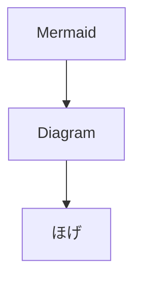

# Document

テストアプリの設計情報をまとめよう。

## 要求

- これしたい
- あれしたい
- これも
- それも

[subpage](Document%201cbcb0bb430c80fc844eec6585dcae2c/subpage%201cbcb0bb430c80b1b752d05fc160251d.md)

[サブページ](Document%201cbcb0bb430c80fc844eec6585dcae2c/サブページ 1cdcb0bb430c80c198f9e6bf8bfaefe9.md)

[日本語](https://github.com/monogocoro/wiki-test/wiki/%E6%97%A5%E6%9C%AC%E8%AA%9E-1cdcb0bb430c8058a85ae5e72a5b7db1)

[あ](monogocoro/wiki-test/wiki/%E3%81%82-1cdcb0bb430c802cb318d6a01e0aaa13)

## 要件

- これする
- あれする
- これはしない

要件定義

[要件定義](https://www.notion.so/1cbcb0bb430c80bd90adfd037ae811a1?pvs=21)

## 外部仕様

ユーザが必要とする仕様

## 外部設計

外部仕様をもとに主にUI周りを設計

## 内部仕様

開発者用の仕様

## 内部設計

内部仕様をもとに開発用