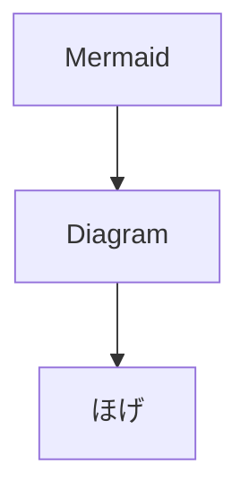

# 設計書

テストアプリの設計情報をまとめよう。

## 要求

- これしたい
- あれしたい
- これも
- それも

[サブページ](%E8%A8%AD%E8%A8%88%E6%9B%B8%201cbcb0bb430c80fc844eec6585dcae2c/%E3%82%B5%E3%83%95%E3%82%99%E3%83%98%E3%82%9A%E3%83%BC%E3%82%B7%E3%82%99%201cbcb0bb430c80b1b752d05fc160251d.md)

## 要件

- これする
- あれする
- これはしない

要件定義

[要件定義](https://www.notion.so/1cbcb0bb430c80bd90adfd037ae811a1?pvs=21)

## 外部仕様

ユーザが必要とする仕様

## 外部設計

外部仕様をもとに主にUI周りを設計

## 内部仕様

開発者用の仕様

## 内部設計

内部仕様をもとに開発用